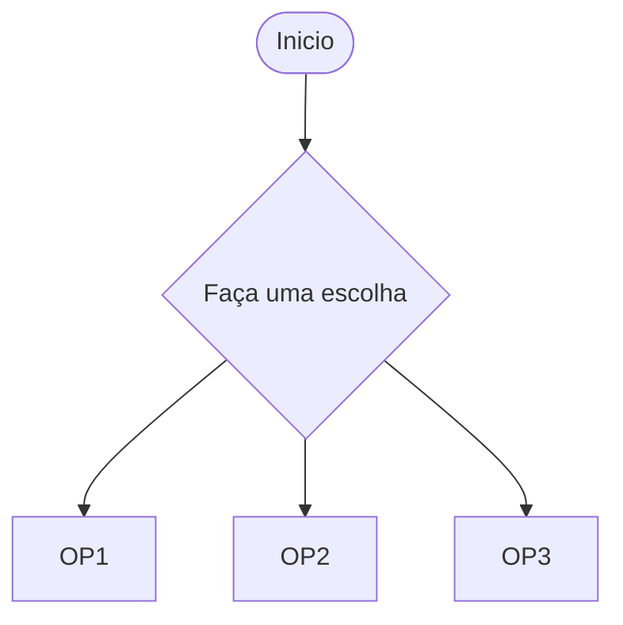
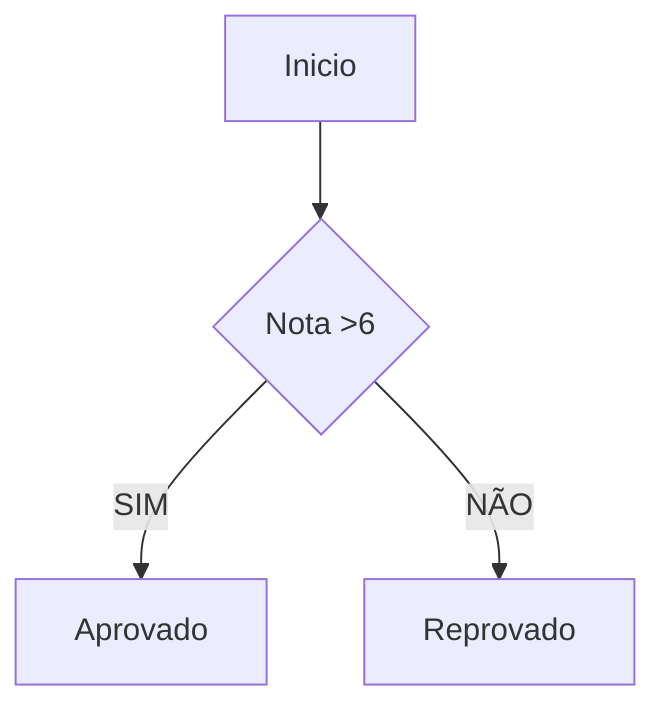
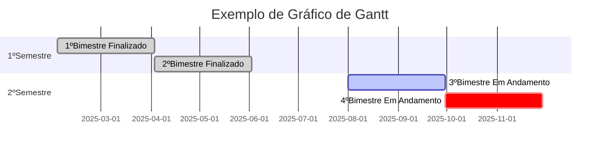
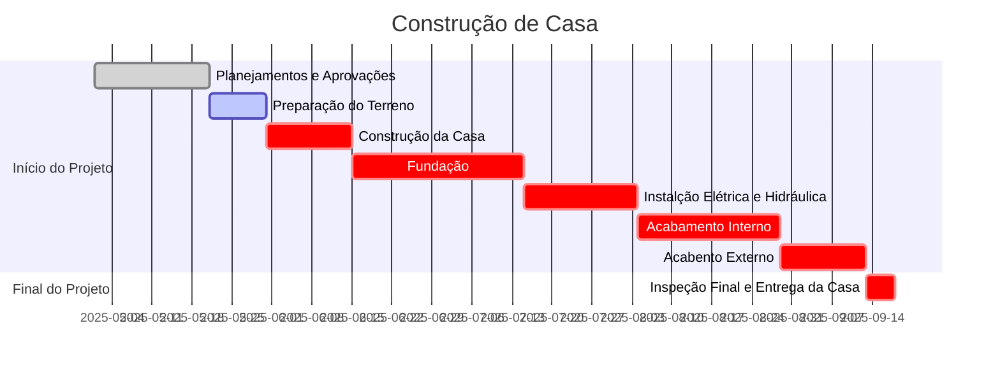
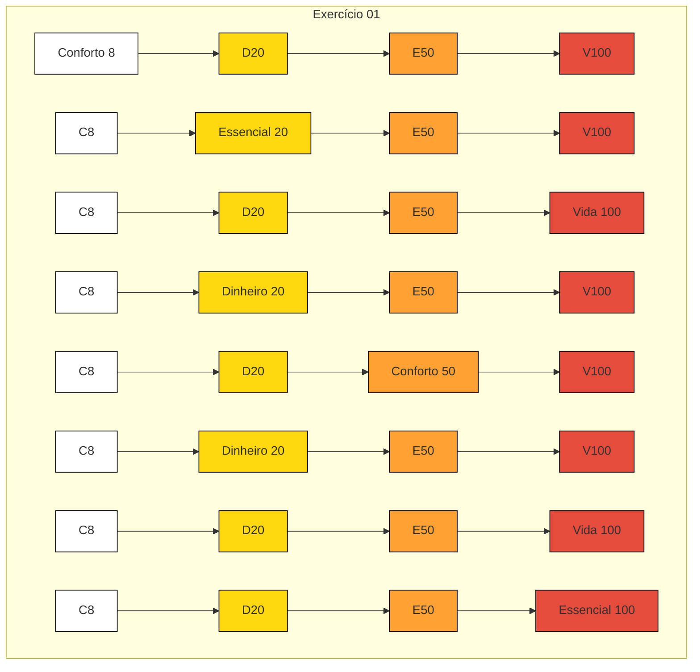
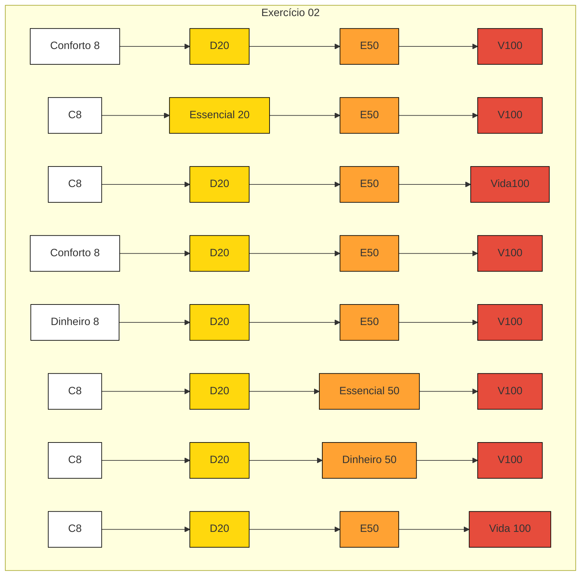
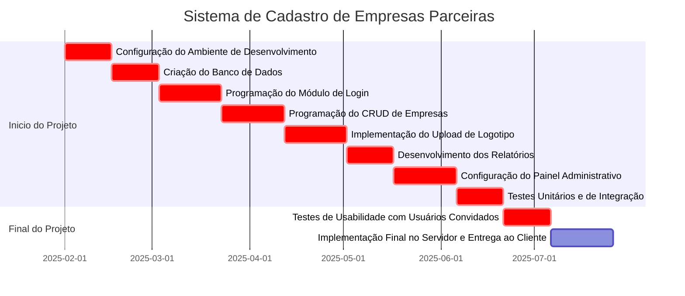
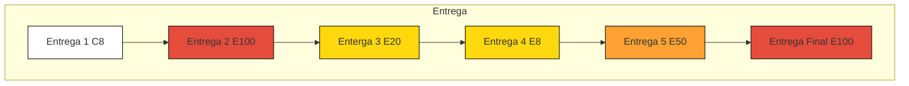

# Grafico-Gannt

# Grafico-Gannt-Atividade

# Metodo-Agil-Crystal

# Gantt - Avaliativa / Sistema de Cadastro de Empresas Parceiras

# Metodo-Agil-Crystal / Sistema de Cadastro de Empresas Parceiras

